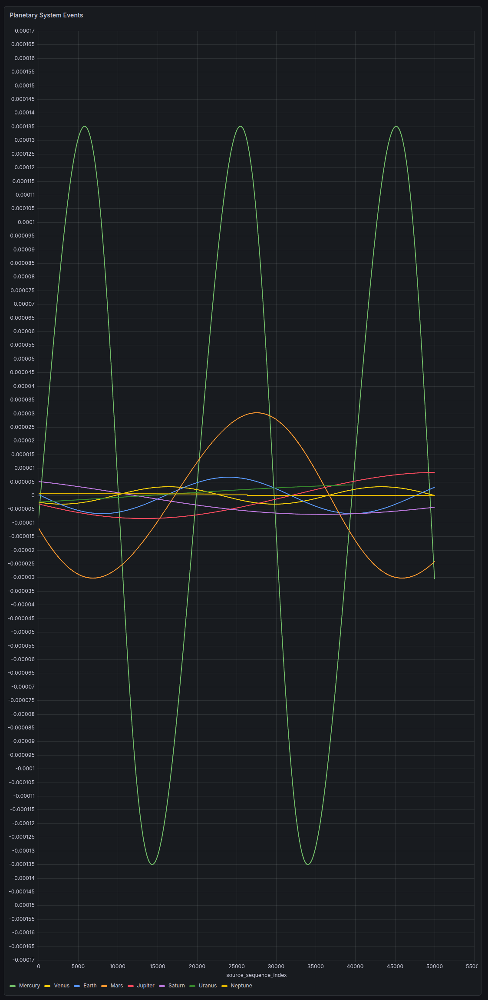

# Planetary System Events — Δq/q per planet across the event index



A Grafana **XY-chart** panel (QuestDB datasource) of the per-source successive
relative amplitude difference `q_relative_diff` = Δqᵢ/qᵢ for all eight planets,
plotted against the **event index** `source_sequence_index`, read live from
`qdb.planetary_reception_stream`.

- **Query:** [`grafana_planetary_reception.sql`](grafana_planetary_reception.sql) — the all-planets pivot at the bottom of the file.
- **Panel:** XY Chart · x-field = `source_sequence_index` · y = the per-planet columns.
- **Data:** the 25-year stream generated by [`../scripts/generate_long_stream.py`](../scripts/generate_long_stream.py).

## What it is

`q_relative_diff` is the relative change of a source's return amplitude between
**its own successive returns** (Mercury vs previous Mercury, …), `NULL` on each
source's first return. Because the round trip is `τ = 2r/c` and `q ∝ 1/r² ∝ 1/τ²`,

```
Δq/q = −2 · Δτ/τ
```

so this figure is, exactly, the **relative variation of the round-trip time**
for each planet across the event index — the fractional change in how long the
echo takes to come home, step by step. It is the transition signal the SKA
learner consumes.

## How to read it

**Oscillation around zero → bound orbits.** Over one orbit the distance returns
to itself (`∮ dr = 0`), so the signal is zero-mean. **Positive** = round trip
shortening = planet **approaching**; **negative** = lengthening = **receding**.
One cycle is one orbit.

**Amplitude ranks by eccentricity, not distance.** Mercury dominates
(±1.35×10⁻⁴, e = 0.206), Mars is next (±3×10⁻⁵), while near-circular Venus and
Earth stay tiny despite being inner. The swing is the radial speed
`≈ e·v_orb` (`Δq/q ≈ −4 v_r/c`): how much `r` — and therefore `τ` — actually varies.

**Period scales as √a — which is why all eight fit on one screen.** In the event
index the oscillation period is `P/τ ∝ a^{3/2}/a = √a`. So the orbital-period
spread of **~680×** (Mercury 88 d → Neptune 165 yr) is compressed to **~9×**
(`√(30.07/0.387)`). On a wall-clock axis Mercury and Neptune can never share a
plot; on the event index they do. Choosing the event index is not a relabeling —
it is a physical re-parameterization of time that flattens Kepler's third law.

**The event index is not uniform in time.** Each step forward is a *different*
Δt (globally ~0.007 s to ~464 s between ticks; per source, ~its round trip, which
itself breathes with the orbit). The self-referential twist: that varying
interval **is** the plotted quantity — the y-axis is the relative variation of
the x-axis's own time-step. There is no external clock; the sampling interval and
the signal are one and the same.

**Each curve ends where its source runs out of returns.** Neptune stops at its
26,352nd echo (its 25-year total), Uranus at ~39,623, and so on; only the fast
inner planets reach the 50,000-index window. Where a curve ends is a real
boundary, not an anomaly.

## Why the event index, and not time

The Sun-as-agent has no wall clock — only the sequence of returned echoes. Its
native coordinate is the event count (the tick), and that coordinate is exactly
the one that equalizes the planets. A learner working in event-space can compare
Mercury to Neptune and build cross-source relations that a time axis would
scatter beyond comparison. The absence of a clock is not a limitation of the
abstraction; it hands the learner the correct coordinate for the job.
