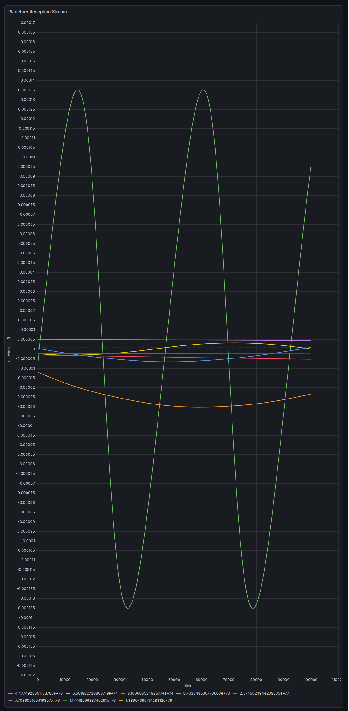

# The planetary reception stream — Δq/q on the real index `tick`



A Grafana **XY-chart** panel (QuestDB datasource) of `q_relative_diff` = Δqᵢ/qᵢ
plotted against the **reception-stream index `tick`**, read live from
`qdb.planetary_reception_stream`. It is a **single stream** — one event per index —
here colored by source so each planet is legible.

- **Query:** [`grafana_reception_stream_tick.sql`](grafana_reception_stream_tick.sql) — two forms:
  - the **display** query, one nullable column per source (so Grafana colors each planet);
  - the **learner's** query, one plain column — the raw stream with no source split.
- **Panel:** XY Chart · x = `tick` · y = `q_relative_diff` · **Connect null values = true** (each per-source column is non-null only on its own ticks, so this draws one line per planet).
- **Data:** the 25-year stream generated by [`../scripts/generate_long_stream.py`](../scripts/generate_long_stream.py).

> **What the learner receives — and what it doesn't.** Every event carries its
> **source Compton-frequency signature** (`source_compton_frequency_hz` = Mc²/h),
> a genuine observable of the returned wave, alongside `q_relative_diff`. So the
> learner *can* tell the eight sources apart by frequency — the separated curves
> above **are the stream to learn**, not a decoration. The only thing withheld is
> each source's **name** (Mercury, Venus, …): that mapping lives in the truth map
> and is used to score what the learner discovers, never as input. (The colors
> here just render that already-present frequency split; only the *legend names*
> come from the truth map.)

## One event per index

`tick` is the global reception-stream counter: **1 … 4,745,929**, strictly
increasing, fully unique — **exactly one echo per integer tick**, in true
chronological order. And that echo belongs to **exactly one source**: tick 100 is
a Mercury return, tick 101 a Venus return, tick 102 Mercury again — whichever
wavefront happens to come home next.

So the stream is one value per index — but each event is **tagged by its source
frequency** (`source_compton_frequency_hz`), and that frequency is *observed*, in
the stream. Routing `q_relative_diff` into a per-frequency column (leaving the
other seven `NULL`) is therefore faithful: it exposes real structure the learner
also sees, not an external label. What is genuinely *not* in the stream is the
planet **name** — only the frequency is. The learner's job is exactly to
discover, from the frequency-tagged transition signal, the structure we happen to
call the eight planets.

## What it is

`q_relative_diff` is the relative change of a source's return amplitude between
its own successive returns. Because the round trip is `τ = 2r/c` and
`q ∝ 1/r² ∝ 1/τ²`,

```
Δq/q = −2 · Δτ/τ
```

so each point is the **relative variation of the round-trip time** — the
fractional change in how long that echo took to come home. This single sequence
is exactly the transition signal the learner consumes, in the order it arrives.

## How to read it

`tick` is essentially real time (~190,000 events/yr), so the **~100,000-event
window** shown is **~0.53 yr**. What each planet does in that window is set by its
orbital period:

- **Mercury** (green) dominates — most frequent (~78× Neptune) and most eccentric
  (e = 0.206, ±1.35×10⁻⁴); it completes **~2 oscillations** (88-day orbit) across
  the window.
- **Mars** (orange) traces a slow arc near the bottom — ~0.28 of its 687-day orbit.
- **Neptune** (yellow) shows one gentle rise-and-fall; **Earth** (blue) a shallow
  dip; **Saturn** (purple), **Jupiter** (red) and **Uranus** (green) sit as
  near-flat lines — the outer and near-circular planets barely move (Neptune
  covers only ~0.15 of an orbit in the *entire* 25-year dataset).

**Sign:** positive = round trip shortening = approaching; negative = lengthening
= receding. **Amplitude ranks by eccentricity** (`Δq/q ≈ −4 v_r/c ≈ −4 e v_orb/c`),
not by distance. **Sampling density along `tick`** is the real reception cadence —
the stream is Mercury-dense simply because Mercury's echoes return most often
(each planet's line is only sampled on its own ticks).

## Why `tick`

The Sun-as-agent has no wall clock — only the ordered sequence of returned
echoes. `tick` **is** that sequence: its native, honest coordinate, one event per
integer, one value per event. Anything that puts the eight planets on a shared,
comparable axis (e.g. pivoting on each source's own return counter) is a
*re-parameterization*, not the stream: it aligns 8 distinct events under one
index. The stream itself is this single line.

