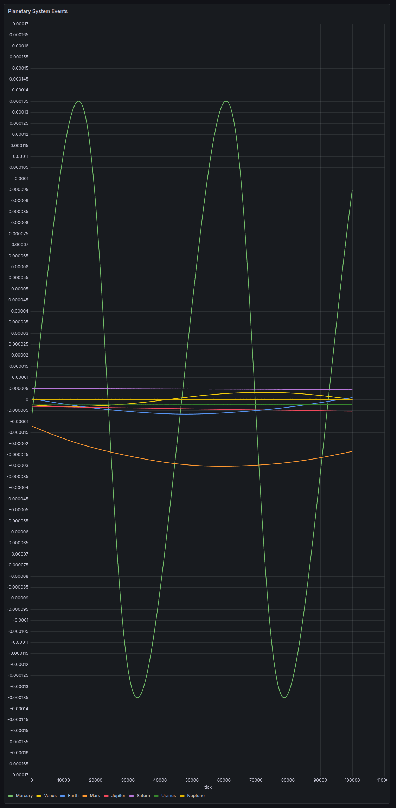

# The planetary reception stream — Δq/q on the real index `tick`



A Grafana **XY-chart** panel (QuestDB datasource) of `q_relative_diff` = Δqᵢ/qᵢ
plotted against the **reception-stream index `tick`**, read live from
`qdb.planetary_reception_stream`. It is a **single stream** — one event per index —
here colored by source so each planet is legible.

- **Query:** [`grafana_reception_stream_tick.sql`](grafana_reception_stream_tick.sql) — two forms:
  - the **display** query, one nullable column per source (so Grafana colors each planet);
  - the **learner's** query, one plain column — the raw stream with no source split.
- **Panel:** XY Chart · x = `tick` · y = `q_relative_diff` · draw as **points** (not connected lines).
- **Data:** the 25-year stream generated by [`../scripts/generate_long_stream.py`](../scripts/generate_long_stream.py).

> **The colors are annotation, not the stream.** Splitting by planet uses the
> source label — the truth map the SKA learner is *not* given. What the learner
> actually receives is the single unlabeled series below:
>
> 

## One event per index

`tick` is the global reception-stream counter: **1 … 4,745,929**, strictly
increasing, fully unique — **exactly one echo per integer tick**, in true
chronological order. And that echo belongs to **exactly one source**: tick 100 is
a Mercury return, tick 101 a Venus return, tick 102 Mercury again — whichever
wavefront happens to come home next.

So the stream is a **single interleaved scalar signal**, `q_relative_diff(tick)`
— **not** eight per-planet curves: each index carries exactly one value. Coloring
it by planet (the display query routes that one value into a per-source column,
leaving the other seven `NULL`) keeps one value per row — it only *annotates*
each point with its source. That labeling requires the truth map the SKA learner
is *not* given, so the colors are for us, not part of the stream.

## What it is

`q_relative_diff` is the relative change of a source's return amplitude between
its own successive returns. Because the round trip is `τ = 2r/c` and
`q ∝ 1/r² ∝ 1/τ²`,

```
Δq/q = −2 · Δτ/τ
```

so each point is the **relative variation of the round-trip time** — the
fractional change in how long that echo took to come home. This single sequence
is exactly the transition signal the learner consumes, in the order it arrives.

## How to read it

`tick` is essentially real time (~190,000 events/yr), so the 50,000-event window
shown is **~0.26 yr**. As one interleaved signal, the figure separates into
structure by amplitude and cadence:

- The large **envelope** is **Mercury** — most frequent (~78× Neptune) and most
  eccentric (e = 0.206, ±1.35×10⁻⁴), so it dominates the signal; it completes
  ~1 oscillation (88-day orbit) across the window.
- The slow **diagonal band** is **Mars**, tracing ~0.14 of its 687-day orbit.
- The **dense cluster at zero** is everything else — the near-circular and outer
  planets, whose round trips barely change over a quarter-year (Neptune covers
  only ~0.15 of an orbit in the *entire* 25-year dataset).

**Sign:** positive = round trip shortening = approaching; negative = lengthening
= receding. **Amplitude ranks by eccentricity** (`Δq/q ≈ −4 v_r/c ≈ −4 e v_orb/c`),
not by distance. **Point density along `tick`** is the real reception cadence —
the stream is Mercury-dense simply because Mercury's echoes return most often.

## Why `tick`

The Sun-as-agent has no wall clock — only the ordered sequence of returned
echoes. `tick` **is** that sequence: its native, honest coordinate, one event per
integer, one value per event. Anything that puts the eight planets on a shared,
comparable axis (e.g. pivoting on each source's own return counter) is a
*re-parameterization*, not the stream: it aligns 8 distinct events under one
index. The stream itself is this single line.
